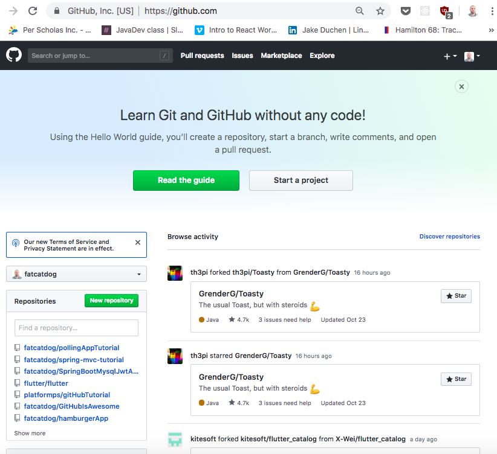
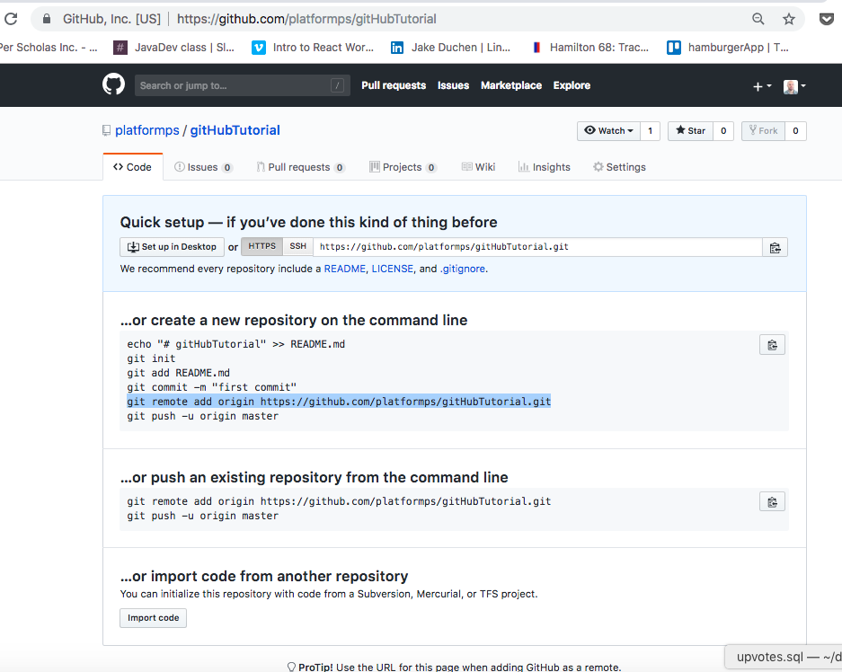
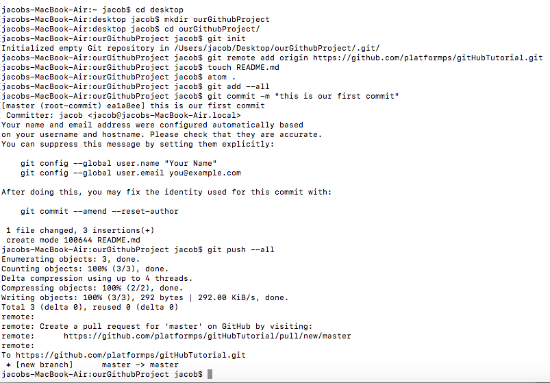
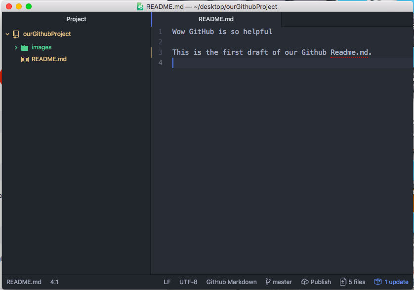
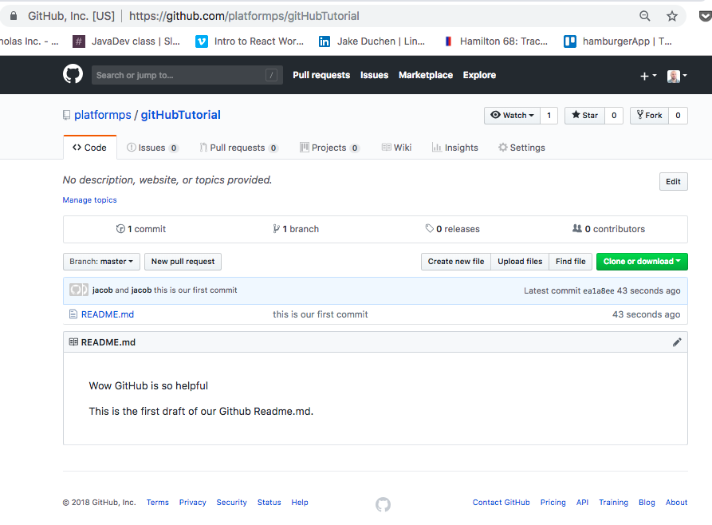
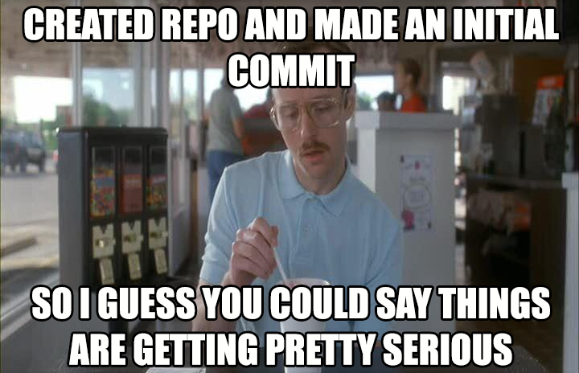

Laura Godinez Edit for git push demo 

# GitHub Tutorial

To set up Git and GitHub please attempt to follow these helpful tutorials.

## GitHub Official Helpful Tutorials

https://help.github.com/articles/signing-up-for-a-new-github-account/  

https://help.github.com/articles/set-up-git/

## Non-Official Helpful Tutorials

https://dev.to/landonp1203/how-to-properly-set-up-git-on-your-computer-33eo

https://product.hubspot.com/blog/git-and-github-tutorial-for-beginners

To test if Git and GitHub is set up correctly, please open your Terminal(Mac) or Command Prompt(Windows). Please type: git

If you get an error that says something along the lines of "command not found" something went wrong and we need to fix your set up. Feel free to Google it, because chances are you will find 1000 other developer's talking about your exact problem and potential solutions. If the problem persists, please email your instructor they will be happy to assist.

If you were able to create your account and set up your environment successfully please proceed to the next section.

##  Let's Create A Repo!(repository)

**1.** Please click the Start A Project button on the GitHub homepage:

**2.** I named my repo gitHubTutorial, I click create, and that brings me to this screen:

**3.** I'm on a Mac, so I am going to open up my terminal (Windows please open your Command Prompt). Here is a screenshot of my terminal which will be followed by an explanation of each line.

**4.** Feel free to open up this image in a new tab because I'm going to continue referencing it in the next few paragraphs. When you boot up your terminal. You are encouraged to follow along on your own computer.

The terminal opens up in my computer's root directory. But I would prefer to save my project on my desktop not somewhere in the root of my computer. To see the subdirectories and files of your current folder type: ls
and click enter.

**5.** **cd desktop** - This command opens my desktop folder.

Now that I'm where I want to be I will create a project folder.

**6.** **mkdir ourGithubProject**  - This command mkdir creates a directory named ourGithubProject. If you are currently in your desktop in your terminal, you will notice that after running this command a folder with the name ourGithubProject was just created. You can really name it whatever you like.

**7.** **cd ourGithubProject** - This command opens my ourGithubProject folder so now I am inside of it.

**8.** **git init** - Git explains that this command does the following "This command creates an empty Git repository - basically a .git directory with subdirectories for objects, refs/heads, refs/tags, and template files. An initial HEAD file that references the HEAD of the master branch is also created." The way I think about it, git init simply starts a git project.

**9.** **git remote add origin xxxxxxxxxxxxxxxxx.git** - When I created my repository on Github.com, that brought me to an empty repo page. I copy the line that is highlighted, and paste it in my terminal. This line basically tells our local git repo (the repo on our computer) that it's corresponding Github.com repo lives at this URL.

**10.** **touch README.md** - This command creates (touch = create file)  a file named README.md (.md means that this file is a markdown file). GitHub looks for a file entitled READE.md at the root of every repo created which will basically be displayed to GitHub users viewing your repo online.

**11.** **atom .** - This command opens up my current directory in Atom (Atom is great free code editor useful for tasks like this one. More can be found about Atom at https://atom.io/)

If you do not use Atom like I do, please open up this directory in your preferred code editor.

**12.** Now that Atom opened, I am going to write some text in my README.md file. Feel free to write what ever you would like in your readme.md.

You can write any plain old text, add images, videos, and a lot of other things in markdown. You can make really fancy documents in markdown with minimal coding. Here is a helpful markdown tutorial: https://github.com/adam-p/markdown-here/wiki/Markdown-Cheatsheet

Developers use markdown to make their repos professional looking, provide instructions for running or installing  projects for potential users, and tell potential employers/users what a project is all about.

Now that we have some text inside of our README.md, lets try git this up on our Github page!

**13.** **git add --all** - Git says about git add, "This command updates the index using the current content found in the working tree, to prepare the content staged for the next commit." I think of git add --all as a command to really stuff everything in your local git repo.

**14.** **git commit -m "this is where you describe what changes your made recently in your project. An appropriate title might be, added a readme with text in it"** - This command basically provides the title to edition to your repo that you are about to finalize.

**15.** **git push --all** -Git says about git push, "Updates remote refs using local refs, while sending objects necessary to complete the given refs." I think of the git push command as the command that actually pushes your code from your local repo to the Github.com repo living in the cloud. If you go to Github.com, your repo should now be updated with your new code (Refresh the Github page if need be). If this is your first time trying to push something from your computer, your terminal will likely ask you to sign in here. If something went wrong, in your terminal, you will see a bunch of errors :(

We just pushed our first commit to Github! Congrats that is awesome. If you find yourself forgetting git commands and processes, feel free to Google it because you are not the only one that has ever been confused by working with Git and Github. After continuing to work on your project, you only have to repeat the: **git add --all, git commit -m "your custom message which should change each commit", and git push --all**

Let's double check the website to see how our README.md looks. And WahhLahh!

Git gets more complicated when working with teams, with multiple people committing to same project, and it is important to talk to your team members to ensure you aren't screwing up a project unintentionally. Thankfully with Github, you can always look at past versions of your project when something goes wrong :)

You should commit early and often. I committed a few times while writing this README.md file. If someone sits on your laptop and breaks your laptop halfway through coding a project, you should be upset because your laptop is broken, but thankfully you committed before walking away from your laptop so you don't have to be upset about losing any important project changes that you just coded.

Now for some blessed internet humor:

